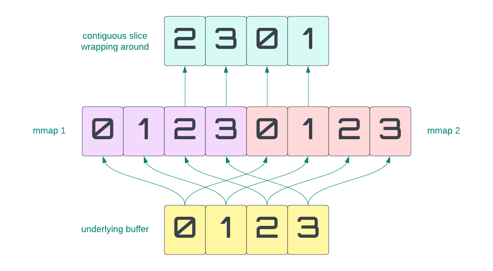

[](https://github.com/sklose/voodoo-buffers/actions/workflows/ci.yml)
[](https://crates.io/crates/voodoo-buffers)

# Voodoo Buffers

A Virtual Ring Buffer (or Magic Ring Buffer) implementation for Rust. Voodoo Buffers provide a simplified
way to deal with buffers that wrap around by delegating that logic to hardware.



The same underlying buffer is mapped twice into memory at adjacent addresses. This allows to wrap around the
buffer while still reading forward in the virtual address space.

This behavior is useful for a variety of applications:

- network protocol parsers with a fixed size buffer
- VecDec implementations that can provide a consecutive slice of memory (
  e.g. [SliceDeq](https://github.com/gnzlbg/slice_deque))
- IPC ring buffer implementations

## Examples

### Allocating a Buffer

Buffer lens have to be page aligned and follow the allocation
granularity of the operating system

```rust
use voodoo_buffers::*;
let buf = VoodooBuffer::new(1 << 16).unwrap();
```

| OS      | Architecture | Min Buffer Len |
|---------|--------------|----------------|
| Windows | x86_64       | 64 KiB         |
| Linux   | x86_64       | 4 KiB          |
| OSX     | x86_64       | 4 KiB          |
| OSX     | aarch64      | 16 KiB         |

** PRs welcome to complete this list

### Indexing into a Buffer

```rust
use voodoo_buffers::*;
let mut buf = VoodooBuffer::new(1 << 16).unwrap();
buf[0] = b'1';
buf[1] = b'2';

// index wraps around
assert_eq!(buf[0], buf[1 << 16]);
assert_eq!(buf[1], buf[(1 << 16) + 1]);
```

### Slices

```rust
use voodoo_buffers::*;
let buf = VoodooBuffer::new(1 << 16).unwrap();

// the whole underlying buffer starting at pos 0
let a = & buf[0..(1 << 16)];

// the whole underlying buffer starting at pos 1
// then wrapping around with the first byte at the end
let b = & buf[1..(1 << 16) + 1];
```
